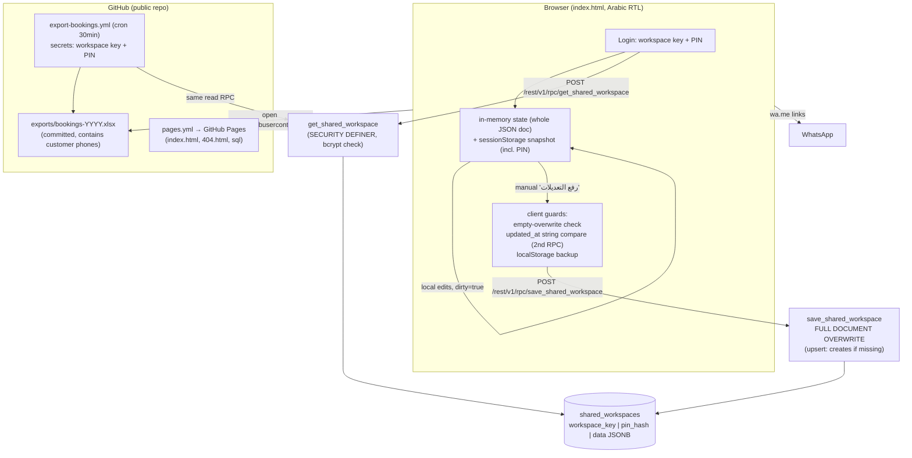

# Booking & Payment-Readiness Audit

- **Repository:** `qw1qw66-sudo/index.html` (public)
- **Audit branch:** `claude/audit-payment-foundation-pe58nl`
- **Starting commit (tip of `main` at audit time):** `836f68bedf37915367e55a69beadb30dc27fa8a0` (2026-07-11 00:57:02 +0000, `chore(export): refresh bookings Excel [skip ci]`)
- **Audit date:** 2026-07-11
- **Scope:** read-only inspection of the whole repository, the deployed app surface (`index.html`), the Supabase RPC backend (`database/shared_workspace_sync.sql`), CI workflows, export pipeline, tests, and open/merged PRs. No production system was touched.

Every finding below states whether it existed before this branch. **All findings pre-exist this branch** — the branch started exactly at the `main` tip with a clean tree, and Phase 0/1 made no code changes.

---

## 1. System architecture (as actually implemented)

### 1.1 Surfaces

| Surface | Path | Status |
|---|---|---|
| Production app | `index.html` (single file, Arabic RTL, no frameworks, no external JS/CSS) | Deployed via GitHub Pages |
| Error page | `404.html` | Deployed |
| Backend definition | `database/shared_workspace_sync.sql` (the only SQL that matches production) | Deployed to Pages as a file; applied manually to Supabase |
| Excel export | `.github/workflows/export-bookings.yml` + `scripts/*.py` + `templates/` | Runs every 30 min, commits to `main` |
| QA | `.github/workflows/qa.yml` (lint, build-check, vitest, Playwright) | Runs on PRs and pushes to `main` (export pushes carry `[skip ci]`) |
| Legacy artifacts | `archive/`, `supabase/migrations/*`, `database/supabase-schema.sql`, `database/supabase_schema.sql`, `chalets-supabase-schema.sql`, `pump-tracker (1).html`, `Excel` (1-byte file) | Not deployed; several are stale/misleading (see AUD-013) |

- Default branch: `main`. GitHub Pages deploys `dist/` built from `main` (only `index.html`, `404.html`, `database/shared_workspace_sync.sql`).
- Supabase project: `https://fkqidesfrtpwzjcimjoe.supabase.co` with a publishable anon key embedded in `index.html` (`index.html:1066-1067`). This is a **public** anon value by design, not a leaked secret.

### 1.2 Data model — there is no bookings table

The entire workspace is **one JSONB document** in one row:

```
shared_workspaces (
  workspace_key text primary key,   -- e.g. "ALI6"
  pin_hash      text,               -- bcrypt (pgcrypto crypt, cost 12)
  data          jsonb,              -- THE WHOLE APP STATE
  created_at, updated_at timestamptz
)
```

`data` = `{ schema_version: 3, settings: {…}, chalets: [ {id, name, …, periods[6]} ], bookings: [ … ] }`

A booking object (from `normalizeData`, `index.html:1405-1425`):

```
{ id, customer_name, customer_phone, chalet_id, booking_date, period_id,
  guests, total, paid, status,            // total/paid are JS floats
  notes, remaining_status, remaining_note, remaining_updated_at,
  deleted_at, created_at, updated_at }
```

Answers to the mandated pre-design questions:

| Question | Verified answer |
|---|---|
| Where are bookings stored? | Inside `shared_workspaces.data->'bookings'` (JSONB array). **No relational booking row, no FK.** |
| How are booking IDs generated? | `crypto.randomUUID()` in the browser (`uid()`, `index.html:1127`), with a `id_<ts>_<rand>` fallback for very old browsers. |
| Are booking IDs stable? | Yes once created: edits `Object.assign` onto the same object; deletes are soft (`deleted_at`). IDs are UUIDs — unique enough for payment references. **But** a lost-update overwrite (AUD-002) can remove or resurrect entire bookings, so ID *presence* is not durable. |
| How is the document read/written? | Read: RPC `get_shared_workspace(key, pin)`. Write: RPC `save_shared_workspace(key, pin, data)` — **the entire document is replaced on every save** (`database/shared_workspace_sync.sql:167-171`). |
| Is the whole JSON overwritten on save? | Yes, unconditionally (after PIN check). No merge, no revision check server-side. |
| Can concurrent devices overwrite each other? | Yes (AUD-002). The only guard is a client-side `updated_at` equality pre-check in a *separate* RPC call — a textbook TOCTOU race. |
| Can server-side code validate a booking from the JSON? | Yes: any SECURITY DEFINER function or Edge Function can `select data from shared_workspaces where workspace_key = …` and inspect `data->'bookings'`. This is the basis of the payment foundation in this branch. |

### 1.3 Real flows (verified in code)

- **Login** (`pullWorkspace`, `index.html:1669`): normalize key → `get_shared_workspace` → on success, whole doc replaces local state; `lastCloudUpdatedAt`/`lastCloudCounts` recorded. Unified Arabic error for wrong PIN / missing workspace.
- **Create account** (`createWorkspace`, `index.html:1702`): sends a **canonical empty document** through `save_shared_workspace`. The SQL upserts: *if the key does not exist → insert; if it exists and PIN matches → overwrite data with the empty document* (see AUD-001).
- **Local editing:** all edits mutate an in-memory `state`; `dirty` flag set; snapshot (including the **PIN**) written to `sessionStorage` for same-tab refresh recovery (`persistSessionSnapshot`, `index.html:1285-1304`).
- **Cloud upload** (`uploadChanges`, `index.html:1765`): manual button only. Guards, in order: must have logged in this session → must have `lastCloudCounts/lastCloudUpdatedAt` → *empty-overwrite guard* (blocks if local is empty and cloud is not) → **fresh `get_shared_workspace` and string-compare `updated_at`** → local backup to `localStorage` (keep 10) → `save_shared_workspace` with the full doc.
- **Booking conflict check** (`findConflict`, `index.html:1635`): browser-only; confirmed+non-deleted bookings of the same chalet with overlapping period time intervals. Nothing equivalent exists server-side.
- **Amounts** (`saveBooking`, `index.html:2388`): `total`/`paid` parsed by `parseMoneyInput` (Arabic/Persian digits normalized; commas stripped; decimals kept → **floats**). Validation: non-negative, `paid ≤ total`. `remaining` = `max(0, total - paid)` (derived, not stored). "المبلغ اكتمل" sets `paid = total` client-side. **`paid` is freely editable with no transaction record** (AUD-004).
- **Payment status:** derived per render: `remaining_status` (manual dropdown: unreviewed / customer_pending / worker_received / transferred / no_remaining) + computed remaining. No ledger, no history, no actor.
- **Voucher** (`voucherText`, `index.html:2508`): plain-text receipt with total/paid/remaining; editable in a textarea; copy / Web Share / WhatsApp `wa.me/<digits>?text=<encodeURIComponent>`.
- **WhatsApp:** `normalizePhoneForWhatsApp` (`index.html:2555`) — digits-only KSA normalization (`05… → 9665…`, `00966…`, `+966…`); opens `https://wa.me/…` with `noopener,noreferrer`.
- **Excel export:** GitHub Action (30-min cron) calls the same public read RPC using repo secrets `EXPORT_WORKSPACE_KEY`/`EXPORT_ACCESS_PIN`, fills `templates/booking-template.xlsx` (openpyxl), and **commits `exports/bookings-YYYY.xlsx` + a JSON report into the public repo**. The app's "فتح ملف Excel الأونلاين" button opens the committed file via `raw.githubusercontent.com` (`index.html:2722-2730`).

### 1.4 Data-flow diagram



### 1.5 Existing checks — actual results at `836f68b`

| Command | Result | Notes |
|---|---|---|
| `npm ci` | **FAILS** | No `package-lock.json` in the repo. CI uses `npm install`. Documented fact, not invented. |
| `npm install` | OK | All devDependencies pinned to `latest` (see AUD-010). |
| `npm run lint` | PASS (0 errors, 1 warning) | Pre-existing warning: unused `QUEUE_KEY` in `archive/legacy-public-surfaces/src/lib/syncService.js:4`. |
| `npm run build` | PASS | `scripts/build-check.mjs` static string checks. |
| `npm test` | PASS 6/6 | `tests/booking-conflict.test.js` — note it re-implements the conflict logic rather than importing the app's (see AUD-010). |
| `npm run e2e` | **FAIL 1/6, pass 5/6** | `e2e/app.spec.js:123` "conflict and voucher use selected period exactly" — pre-existing date-rot failure on `main`, reproduced at the starting commit (see AUD-010 evidence). Playwright browser download was also required by the unpinned `latest` toolchain and had to be satisfied from the environment's pre-installed Chromium. |

---

## 2. Findings by severity

Severity: **P0** data loss / unauthorized access / duplicate charge / wrong balance / double booking / unrecoverable corruption · **P1** major defect · **P2** maintainability/observability · **Info** relevant, not defective.

Confidence: every finding below is **confirmed by code reading at the starting commit**, with the file/lines cited. Items that are risks-if-X rather than defects are labeled Info/assumption. Reproduction steps are against a **non-production test workspace** — do not run them against real data.

---

### AUD-001 · P0 · "Create account" silently wipes an existing workspace

- **Affected:** `index.html:1702-1735` (`createWorkspace`) and `database/shared_workspace_sync.sql:109-184` (`save_shared_workspace`).
- **Evidence:** `createWorkspace()` sends `canonicalEmptyDataModel()` (empty chalets/bookings) via `save_shared_workspace`. The SQL function is an upsert: if the workspace **exists and the PIN matches**, it runs `update … set data = v_data` — replacing all chalets and bookings with the empty document. The client-side "empty overwrite guard" exists only in `uploadChanges()` (`index.html:1774-1783`), **not** in the create flow.
- **Reproduction (test workspace only):** create workspace `TESTX` with PIN `1234`, add a chalet + booking, upload. Log out (close tab). On the login screen enter `TESTX`/`1234` and press **"إنشاء حساب جديد"** instead of "دخول". Result: `ok:true`, workspace opens empty, cloud `data` is now `{}`-equivalent. All bookings gone. Server keeps no history (single row, no versioning). The only recovery is a `localStorage` backup on some device that previously pushed.
- **Impact:** total loss of live booking and payment data from one mis-click of a button that sits directly next to the login button, with credentials the user legitimately has. For payments this also destroys every booking a ledger row would reference.
- **Recommended fix:** (a) server: a dedicated `create_shared_workspace` that **fails if the key exists**, and a save function that **refuses to auto-create** (prepared in this branch as `database/migrations/0001_atomic_workspace_save.sql`, not executed); (b) client: pre-flight existence check in `createWorkspace` that aborts with a clear Arabic message when the workspace already exists (works against the current production RPCs; included in this branch).
- **Blocks payment integration:** **Yes.**
- **Pre-existing:** Yes.

### AUD-002 · P0 · Lost updates between devices — concurrency check is client-side and racy (TOCTOU)

- **Affected:** `index.html:1788-1801` (`uploadChanges`), `database/shared_workspace_sync.sql:109-184` (`save_shared_workspace`).
- **Evidence:** the "optimistic concurrency" is: client calls `get_shared_workspace`, string-compares `updated_at` with the value remembered at pull time, and only then calls `save_shared_workspace`. The two RPCs are separate transactions; `save_shared_workspace` takes `for update` on the row but **never checks any expected revision** — it overwrites unconditionally. DATA-SAFETY.md documents this check as a safety property, but it is not atomic.
- **Reproduction:** devices A and B both pull (same `updated_at = X`). A adds booking α and uploads; B adds booking β and uploads within the pre-check window (or simply: both press upload at once). Both pre-checks read `X`; both saves succeed; the last writer's document replaces the first — booking α (or β) **vanishes silently**, including its `paid` amount. No error is shown to the losing device.
- Even without the race: when B's pre-check does detect a newer cloud version, the only recovery path is a destructive re-pull that discards *all* of B's local edits (confirm dialog, then overwrite) — there is no merge. Lost updates are a designed-in failure mode, only narrowed (not removed) by the pre-check.
- **Impact:** silent loss of bookings/edits; a payment ledger reconciled into `booking.paid` could be visually reverted by a stale device; bookings referenced by payments can disappear.
- **Recommended fix:** atomic compare-and-save inside the database — the save RPC takes the expected `updated_at` and rejects stale writes inside the same locked transaction (prepared as `save_shared_workspace_v2` in `database/migrations/0001_atomic_workspace_save.sql`); client uses it when available with graceful fallback (included in this branch). Ledger data must live **outside** the document (separate tables) so payment truth is never subject to document overwrite — that is the core design rule of the foundation.
- **Blocks payment integration:** **Yes.**
- **Pre-existing:** Yes.

### AUD-003 · P0 · Customer personal data is published to a public GitHub repository every 30 minutes

- **Affected:** `.github/workflows/export-bookings.yml`, `exports/bookings-2026.xlsx`, `exports/bookings-2026-report.json`, `index.html:2719-2730` (`openOnlineExcel`).
- **Evidence:** the repository is **public** (GitHub API: `"visibility": "public"`). `exports/bookings-2026.xlsx` is committed to `main` and demonstrably contains real customer phone numbers (verified by unzipping the committed workbook: sheet2 inline strings include Saudi mobile numbers in `05XXXXXXXX` and `+966…` form next to booking amounts). The report JSON contains booking UUIDs, dates, chalet names, and cell placements. The frontend links to the raw file publicly. ~50 export commits currently form the visible history; the data is also in every historical commit of the file.
- **Reproduction:** open `https://raw.githubusercontent.com/qw1qw66-sudo/index.html/main/exports/bookings-2026.xlsx` while signed out; inspect sheet "ورقة1".
- **Impact:** ongoing disclosure of customer phone numbers tied to booking dates/amounts. Amplified in a payment context (public phone + booking amount is a convincing phishing/fraud kit for fake "payment links").
- **Recommended fix (owner action required, not performed by this branch):** make the repo private **or** move the export artifact to private storage (private repo, Supabase Storage signed URL, or workflow artifact); then purge `exports/` from git history (`git filter-repo`) and rotate `EXPORT_ACCESS_PIN`. This branch does **not** unilaterally disable the export workflow because the app actively links to its output; the decision is the owner's. Until remediated, **no payment links should be sent to customers** whose data is exposed here.
- **Blocks payment integration:** **Yes for real customer use** (policy), no for building the inert foundation.
- **Pre-existing:** Yes.

### AUD-004 · P0 (payment-readiness) · `paid` is a freely editable float with no transaction record

- **Affected:** `index.html:812-844` (paid input + "المبلغ اكتمل" button), `index.html:2308-2317` (`markPaymentComplete`), `index.html:2388-2483` (`saveBooking`), data model.
- **Evidence:** the only financial record is `booking.paid` (a JS number inside the JSONB doc). Anyone with the shared workspace PIN can set it to anything (≤ total) with no who/when/how/why, no payment method, no provider reference, no refund vs adjustment distinction. One tap ("المبلغ اكتمل") marks a booking fully paid. `remaining_status` is likewise a free dropdown. There is no way to reconcile, detect tampering, or explain a balance.
- **Impact:** incorrect financial balances are undetectable; duplicate/false "payments" cannot be distinguished from real ones; any future online payment would have no authoritative record to land in. Legacy data already contains non-zero `paid` values with no history (confirmed: current workspace has 11 bookings, several with partial payments, per the committed export report).
- **Recommended fix:** the immutable payment ledger prepared in this branch (`payment_orders`, `payment_transactions`, `payment_webhook_events`, integer halalas, append-only with trigger-enforced immutability), with `booking.paid` demoted to a reconciled display field. Legacy values migrated as `legacy_opening_balance` transactions (Phase 6 plan).
- **Blocks payment integration:** **Yes — this is the gap the foundation fills.**
- **Pre-existing:** Yes.

### AUD-005 · P0 · Double booking cannot be prevented server-side; cross-device conflicts end in silent booking loss

- **Affected:** `index.html:1634-1651` (`findConflict`), `database/shared_workspace_sync.sql` (no equivalent), architecture.
- **Evidence:** conflict detection runs only in the browser against the locally loaded document. Two devices can each pass their local check and create overlapping confirmed bookings for the same chalet/date/period. At upload time the whole-document overwrite (AUD-002) arbitrates: **one device's booking is deleted wholesale** (with any recorded payment), which is arguably worse than a visible double booking — nobody is told. A direct API caller can skip the browser check entirely and save any document (the RPC validates only the PIN and that `data` is a JSON object).
- **Reproduction:** two browsers, same workspace: both pull, both create a confirmed booking for the same chalet/period/date (their local checks pass — neither sees the other), both upload within the race window (or the second one re-pulls, losing its own booking).
- **Impact:** double-charging risk once payments attach to bookings (customer pays for a booking that is then silently removed); revenue and voucher records diverge between devices.
- **Recommended fix:** with bookings inside JSON, a GiST exclusion constraint is impossible. Smallest safe step (prepared in this branch, not executed): `save_shared_workspace_v2` performs (a) atomic revision check and (b) **server-side validation of the submitted document** rejecting internally conflicting confirmed bookings — because every accepted save is then based on the previously accepted document, two conflicting bookings can no longer both land in the cloud. Full normalization of bookings into rows remains the long-term fix and is explicitly **out of scope** (documented in PAYMENT_ARCHITECTURE.md §8).
- **Blocks payment integration:** **Yes.**
- **Pre-existing:** Yes.

---

### AUD-006 · P1 · PIN brute-force exposure: 4-digit minimum, anonymous RPC, no rate limiting

- **Affected:** `database/shared_workspace_sync.sql:86-98` (PIN length check 4–128, unified error), `index.html:1347-1350` (client minimum 4), Supabase project settings (no API rate limiting configurable at SQL level).
- **Evidence:** `get_shared_workspace` is executable by `anon` and returns success/failure per attempt. There is no lockout, no attempt counter, no per-key throttle. Placeholder text encourages short workspace keys ("ALI6"). A 4-digit numeric PIN is 10,000 combinations. bcrypt cost 12 (~200-300 ms per check) slows a single connection but attempts parallelize across connections; a full 4-digit sweep is a matter of hours, after which the attacker has **full read/write** of the workspace (the same credentials authorize `save_shared_workspace`).
- **Impact:** workspace takeover → read all customer PII, silently modify `paid`/bookings, or wipe data. Directly hostile to payment integrity.
- **Recommended fix:** minimum PIN length ≥ 6 for new workspaces (server-enforced), attempt-throttling table keyed by `workspace_key` inside the verify path (prepared in `0001_atomic_workspace_save.sql` as a per-workspace sliding-window failure counter — practical rate limiting at the SQL layer since no WAF is available), and owner-level Supabase/Cloudflare rate limits documented. Not a silent PIN policy change for existing workspaces.
- **Blocks payment integration:** Should be fixed before real payment links are sent; the foundation itself is not blocked (payment writes additionally require server-verified context).
- **Pre-existing:** Yes.

### AUD-007 · P1 · Workspace PIN and full customer dataset persisted in `sessionStorage`

- **Affected:** `index.html:1105-1106`, `1285-1308` (`SESSION_PIN_KEY`, `persistSessionSnapshot`).
- **Evidence:** the plaintext PIN and the entire workspace snapshot (all customer names/phones/amounts) are written to `sessionStorage` on every dirty-state change. Deliberate (merged PRs #21/#22) to survive same-tab refresh; commented as temporary.
- **Impact:** any XSS (none currently found — see Info-3), malicious extension, or shared-device DevTools access reads the credential that also authorizes destructive writes. Raises the blast radius of every other issue.
- **Recommended fix (later phase, not this branch):** keep only a short-lived opaque session token (requires server-side session RPC), or at minimum encrypt the snapshot with a non-extractable WebCrypto key. Documented; **not** changed in this branch because removing it breaks the refresh-restore feature the owner explicitly merged.
- **Blocks payment integration:** No (payment secrets never live in the browser), but noted in the gate safeguards.
- **Pre-existing:** Yes.

### AUD-008 · P1 · Deleting a chalet cascade-soft-deletes all its bookings (including paid ones)

- **Affected:** `index.html:2217-2233` (`softDeleteChalet`).
- **Evidence:** `softDeleteChalet` marks every non-deleted booking of the chalet `deleted_at = now()` after a single generic confirm. Bookings with `paid > 0` (money already collected) disappear from all lists, reports, and the Excel export (exporter excludes deleted).
- **Impact:** financial records vanish from view in bulk; with a ledger, transactions would point at deleted bookings. (Deactivating a *period* is handled correctly — historical bookings keep working via `getPeriodAny`, `index.html:1454-1456`.)
- **Recommended fix:** block chalet deletion while it has non-cancelled future bookings, or require typed confirmation listing the affected count; ledger side: payments must remain queryable for deleted bookings (the prepared schema keeps them, keyed by booking UUID).
- **Blocks payment integration:** Partially — mitigated in the foundation by refusing new payment sessions for deleted bookings while preserving history.
- **Pre-existing:** Yes.

### AUD-009 · P1 · Dirty local changes are lost without warning on tab close

- **Affected:** `index.html` (no `beforeunload` handler exists — verified by search).
- **Evidence:** edits live in memory + a `sessionStorage` snapshot that only survives same-tab refresh. Closing the tab/browser discards unsaved changes silently; the snapshot dies with the session.
- **Impact:** staff on iPhone (primary device per repo docs) lose entered bookings/payments they believed recorded; they may have already sent the customer a voucher generated from unsaved local state.
- **Recommended fix:** a `beforeunload` prompt while `dirty === true` (small, included in this branch as a P1 safety fix that changes no data flow).
- **Blocks payment integration:** No, but a manual-payment entry lost this way would desync ledger vs. operator expectations (the ledger writes server-side immediately, which actually removes this class of loss for payments).
- **Pre-existing:** Yes.

### AUD-010 · P1 · QA reality: date-rotting e2e test already fails on `main`; toolchain unpinned; conflict test doesn't test app code

- **Affected:** `e2e/app.spec.js:123-155`, `package.json` (all `devDependencies: "latest"`, no lockfile), `tests/booking-conflict.test.js`.
- **Evidence (reproduced at starting commit `836f68b`, clean tree):**
  - `npx playwright test` → **"conflict and voucher use selected period exactly" fails**: timeout at `e2e/app.spec.js:147` waiting for `#bookingList [data-action="voucher"]`. Root cause: the test hard-codes `bookingDate = '2026-06-01'`; `renderBookings()` (`index.html:2001`) lists only `booking_date >= today()` in `#bookingList`; today is 2026-07-11, so the booking renders in the collapsed past list. Merged PR #68 (2026-05-30) fixed this same test and *explicitly predicted this failure mode* ("If a future test books a past date, it would belong in `#bookingPastList`"). The other 5 e2e tests pass.
  - `npm ci` fails (no lockfile); every dev dependency is `latest`, so CI results are non-reproducible over time (this week's Playwright expects browser revision 1228; environments with pre-provisioned browsers break).
  - `tests/booking-conflict.test.js` re-implements conflict logic inside the test file instead of exercising `index.html`'s `findConflict` — it can pass while the app regresses.
  - Export commits use `[skip ci]`, and since **every** recent commit on `main` is an export commit, QA effectively never runs on `main` — the rot was invisible.
- **Impact:** the QA gate is partially fictional; a red e2e on any PR will be blamed on the PR.
- **Recommended fix:** make the e2e test date-independent (use a future date relative to `today()`); commit a lockfile and pin dependency majors (owner decision — **not** done in this branch to avoid a large unrelated diff; documented instead). This branch does not modify the failing test's assertions (that would mask the finding); it is documented as pre-existing and the fix (dynamic future date) is included as a separate clearly-labeled test commit so the suite is meaningful for the payment work.
- **Blocks payment integration:** No, with the new payment tests being deterministic.
- **Pre-existing:** Yes (fails at the starting commit before any change from this branch).

### AUD-011 · P1 · Money handling: decimal-comma inputs silently 10×; Arabic decimal separator rejected; floats as authoritative amounts

- **Affected:** `index.html:1508-1513` (`parseMoneyInput`), `1494-1503` (`normalizeDigits`), data model (`total`/`paid` floats).
- **Evidence:** `parseMoneyInput` strips **all commas** as thousands separators: input `12,5` (a common decimal-comma habit) parses to `125` — saved silently with no warning. The Arabic decimal separator `٫` (U+066B) and Arabic thousands separator `٬` (U+066C) are not normalized: `١٢٫٥` → `12٫5` → `NaN` → save blocked with a generic "المبلغ غير صالح." (better than silent corruption, but poor UX). Amounts are stored as IEEE-754 doubles in JSONB; nothing enforces integer riyals, so `0.1 + 0.2`-class artifacts and long decimals are representable and will disagree with any integer-halala ledger unless conversion is validated.
- **Impact:** wrong booking totals (10× errors) directly corrupt payment amounts; float drift breaks reconciliation.
- **Recommended fix:** ledger uses **integer halalas only** (done in the prepared schema, with checked conversion that rejects sub-halala precision); frontend: treat `٫` as decimal point and reject ambiguous comma usage instead of guessing (documented; the input-behavior change is left for owner sign-off since it alters an existing merged behavior, PR #66).
- **Blocks payment integration:** The ledger side is handled by the foundation; the input-side fix is listed as a YELLOW-gate safeguard.
- **Pre-existing:** Yes.

---

### AUD-012 · P2 · Export workflow: broad `contents: write`, 48 commits/day to `main`, moving-target default branch

- **Evidence:** `export-bookings.yml` holds `contents: write` on a cron; all 50 recent commits on `main` are `chore(export)`. History is polluted; bisecting or reviewing `main` is painful; any compromise of the workflow writes to the repo.
- **Recommended fix:** publish the export as a release asset/branch/artifact or push to a dedicated `exports` branch; narrow the token. Owner decision; interacts with AUD-003 remediation.
- **Pre-existing:** Yes.

### AUD-013 · P2 · Stale, conflicting database artifacts invite a destructive mistake

- **Evidence:** `database/supabase-schema.sql` and `database/supabase_schema.sql` are **byte-identical duplicates** describing a normalized multi-table schema that does not exist in production; `supabase/migrations/001_security_constraints.sql` targets `public.bookings/chalets` tables (nonexistent); `supabase/migrations/20260509_secure_cloud_sync.sql` targets an `auth.users`-based `user_data` model (nonexistent); `chalets-supabase-schema.sql` is a third legacy model; `docs/SECURITY_THREAT_MODEL.md` audits files (`src/main.js`, `sync-cloud/…`) that were archived. Running `supabase db push` naively would apply the stale migrations.
- **Recommended fix:** quarantine legacy SQL under `archive/` with a README, or add loud headers. This branch **adds** `database/migrations/README.md` clarifying apply order and explicitly warning that `supabase/migrations/*` legacy files must not be applied; it does not delete anything.
- **Pre-existing:** Yes.

### AUD-014 · P2 · Stale PR/branch backlog and repo junk

- **Evidence:** ~19 open PRs, including four identical "unminify" PRs (#14/#15/#16/#18 + draft #17), three identical robustness PRs (#36/#37 duplicate #38), and PRs based on a pre-rebuild `main` (#13, #21/#22 already merged in substance). Junk files at root: `Excel` (1 byte), `pump-tracker (1).html` (73 KB unrelated app — matches the repo description "pump-tracker"). None deployed, all confusing.
- **Recommended fix:** owner triage (close duplicates); this branch **does not** close or modify any unrelated PR per the task rules.
- **Pre-existing:** Yes.

### AUD-015 · P2 · Documentation drift

- **Evidence:** README says the working branch is `rebuild/clean-root-app` (doesn't exist on origin; default is `main`); app version string hardcoded `final-808d67d` in Settings; DATA-SAFETY.md describes the client-side pre-check as if it were a strong guarantee (AUD-002 shows it is not).
- **Pre-existing:** Yes.

### AUD-016 · P2 · No server-side observability

- **Evidence:** no logging/alerting on RPC failures, no audit of who saved (the doc has no device/actor identity), Supabase logs unexamined by any process. A brute-force (AUD-006) or mass-wipe (AUD-001) would be invisible until a human notices missing data.
- **Recommended fix:** the prepared migration adds an append-only `workspace_save_audit` (key, counts, revision, hash prefix) as a cheap tamper-evidence layer; broader observability is owner work.
- **Pre-existing:** Yes.

---

### Informational (not defects)

- **Info-1:** The Supabase URL + `sb_publishable_…` anon key in `index.html` are public-by-design values; RLS is enabled, table grants revoked, RPC-only access. **Do not remove or rotate them blindly** — the app breaks and nothing is gained.
- **Info-2:** The RPC hardening is genuinely good: `SECURITY DEFINER` with pinned `search_path = public`, bcrypt PIN hashing (cost 12) with a plaintext-column migration guard, unified not-found/wrong-PIN error (no existence leak), input format validation, `revoke all` + explicit `grant execute` to `anon` only, RLS on with no policies (belt and braces).
- **Info-3:** No XSS found in current rendering paths: every user-controlled value passing through `innerHTML` (18 sites) is wrapped in `esc()`; voucher preview escapes line-by-line; WhatsApp text is `encodeURIComponent`-ed; `wa.me` phone is digits-only; `window.open` uses `noopener,noreferrer`. This is discipline, not a framework guarantee — a lint rule would help keep it.
- **Info-4:** PIN is never written to the debug log (verified: log calls emit workspace key and counts only). The debug panel does render workspace key and booking ids on a shared screen (minor).
- **Info-5:** `save_shared_workspace` strips a client-supplied `updated_at` key from the document and uses `statement_timestamp()` — good; the revision token itself is trustworthy, it's the *comparison location* that's wrong (AUD-002).
- **Info-6 (assumption, unverified):** whether Supabase project-level rate limiting / attack protection is enabled cannot be verified from the repo; treated as absent for AUD-006. Whether daily Supabase backups are enabled is likewise unverifiable from the repo; **assume no restore path** until the owner confirms (relevant to AUD-001/002 recovery).

---

## 3. Payment-readiness checklist (required areas)

| Area | Verdict |
|---|---|
| `paid` changeable without transaction record | Yes — AUD-004 (P0) |
| Audit trail (who/method/amount/date/provider ref/refund/adjustment) | None exists — AUD-004 |
| Floating-point money | Yes, floats everywhere — AUD-011; ledger must use integer halalas |
| Arabic/Persian digit parsing | Handled for digits; decimal `٫` rejected; `,` silently stripped (10× bug) — AUD-011 |
| Partial payments | Representable (`paid < total`) but with no history; over-payment blocked client-side only (`paid ≤ total` check is in the browser; direct RPC bypasses it) |
| Overpayments | Nothing server-side prevents `paid > total` in a crafted document |
| Refunds | Not representable at all (no negative flows, no records) |
| Failed payments | Not representable |
| Expired payment links | No concept of payment links |
| Cancelled bookings | Status exists; cancelled bookings excluded from revenue; nothing prevents "paying" a cancelled booking |
| Deleted bookings | Soft-delete exists; cascade delete from chalet (AUD-008); nothing prevents editing `paid` on a deleted booking via crafted doc |
| Duplicate webhook delivery / out-of-order events / provider retries | No webhook infrastructure exists (greenfield — the prepared foundation covers these) |
| Manual bank-transfer/cash payments | Only as an unauditable `paid` edit + `remaining_status` dropdown (`worker_received`, `transferred`) — the semantics exist in the UI, the record-keeping doesn't |
| Legacy bookings with non-zero `paid` and no history | Confirmed present in production data (export report shows partial payments) — Phase 6 migration plan required |
| Booking IDs stable/unique enough for payment references | Yes (UUIDs), subject to AUD-002 overwrite caveat |
| Secrets committed to frontend | None found (anon key is public-by-design); GitHub Action secrets referenced correctly via `${{ secrets.* }}` |
| Amounts trusted from browser | Entirely — the whole document including `total`/`paid` is client-authored; server validates only shape (`jsonb_typeof = object`). Payment amounts must be computed server-side from the stored document (the foundation does this) |
| Customer data in logs/debug | Not in the debug log; but in the public Excel export — AUD-003 (P0) |
| Unsafe HTML injection via customer fields | None found (Info-3) |
| WhatsApp/voucher encoding | Safe (Info-3) |
| Backup/rollback | Client-side `localStorage` backups (last 10) on pushing devices only; server-side unknown (Info-6). No tested restore path |

---

## PAYMENT IMPLEMENTATION GATE

### Status: **YELLOW** — the *foundation* (schema + inert server code + tests + docs) may be implemented in this branch; **no live payment collection may be enabled** until the safeguards below are met. For real-money operation today the effective status is RED; the specific conditions to clear are enumerated and the blocking P0 fixes are prepared in this same branch.

**Why not GREEN:** P0 findings AUD-001/002/004/005 mean bookings — the objects payments attach to — can silently vanish, be overwritten, or conflict, and there is no financial record at all. Attaching a payment provider to today's system as-is would create real risks of charging for bookings that disappear (AUD-002/005/008) and of unreconcilable balances (AUD-004).

**Why not RED for the foundation:** everything this branch implements is inert by construction — SQL migrations that are **not executed** against production, Edge Functions that are **not deployed**, a provider abstraction whose only implementation is a test adapter that **cannot** create real charges and refuses to run outside explicit test mode, and frontend UI that feature-detects the missing backend and stays display-only with a clear Arabic explanation. The blocking P0s have narrowly-scoped fixes **included in this branch** (atomic compare-and-save + create-only workspace + document-level conflict validation + client-side create guard), which is exactly the "critical fixes" work RED would demand — so the practical difference from RED is that the foundation code is also included, deploy-gated behind those fixes.

### Safeguards required before any real payment goes live (all owner actions):

1. **Apply `database/migrations/0001_atomic_workspace_save.sql`** to the Supabase project (fixes AUD-001/002/005 server-side) and verify the app's upload path uses `save_shared_workspace_v2` (this branch's frontend does so automatically once the function exists).
2. **Remediate AUD-003** (public PII): make the repo/exports private and purge history **before** sending customers payment links referencing these bookings.
3. **Apply `database/migrations/0002_payment_ledger.sql`** (creates the ledger; additive only — touches no existing table).
4. Deploy the Edge Functions to a **Supabase staging project first**; run the test-adapter end-to-end flows there.
5. Configure a real KSA-capable provider (Moyasar/Tap/HyperPay/etc.) **in a sandbox**, implement its adapter against the interface, and pass the full webhook test matrix against the actual sandbox before any production key exists. **This branch ships no real provider integration and must not be claimed to process payments.**
6. Enforce minimum PIN length ≥ 6 + the rate-limit table (in `0001`) before exposing payment endpoints (AUD-006).
7. Decide the AUD-011 input policy (decimal comma) before amounts feed the ledger.
8. Keep `booking.paid` as a display/compatibility field reconciled from the ledger; never hand-edit it for ledger-tracked bookings (enforced progressively; see PAYMENT_ARCHITECTURE.md §6).

### What remains blocked regardless of this branch

- Live charging, refunds against a real provider, provider webhooks in production, any change to production data — all require the safeguards above plus owner-held credentials that must never enter this repository.
