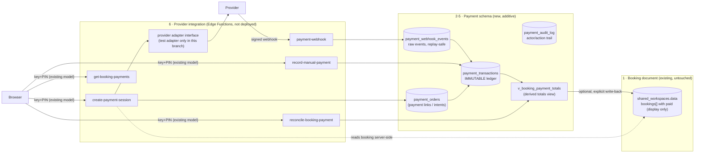

# Payment Architecture

Design for a safe payment foundation on top of the existing JSON-document booking
system, per `docs/AUDIT_PAYMENT_READINESS.md` (gate: YELLOW). Everything here is
**prepared, not deployed**: migrations are not executed against production and
Edge Functions are not deployed by this branch.

## 1. Design rules (non-negotiable)

1. **The payment ledger is the financial source of truth.** `booking.paid`
   inside the workspace JSON document is a *display/compatibility field only*;
   it is derived or reconciled from the ledger, never trusted.
2. **Ledger data lives outside the workspace document**, in dedicated tables.
   The document is replaced wholesale on every save (audit AUD-002); anything
   inside it can be silently lost. Payment truth must be immune to that.
3. **Money is stored as integer minor units** (`amount_halalas`, 1 SAR = 100
   halalas; 1,000 SAR = 100000 halalas). Never JS floats, never Postgres
   float types. Currency is constrained to `SAR` (extendable by migration).
4. **Financial history is immutable.** Transactions are append-only; the
   database rejects `UPDATE`/`DELETE` on recorded rows (trigger-enforced,
   except narrowly whitelisted status transitions on orders/webhook events).
   Corrections are *new* transactions (`adjustment`, `refund`).
5. **Payment truth comes from the database and verified provider events.**
   A browser redirect to a "success" page is never proof of payment. No AI
   output is ever a source of truth for amounts or payment status.
6. **Amounts are computed server-side.** The browser never supplies a
   trusted total/remaining; the server loads the booking from
   `shared_workspaces.data` and computes what may be paid.
7. **Idempotency everywhere:** payment-session creation takes an idempotency
   key; webhook events are unique per `(provider, provider_event_id)`;
   successful transactions are unique per `(provider, provider_transaction_id)`;
   the legacy migration writes deterministic keys. Retries and duplicates
   must be no-ops, not double entries.
8. **No secrets in the repo.** Provider keys/webhook secrets live in Supabase
   Edge Function secrets (`supabase secrets set`), referenced by env name only.

## 2. Component separation



The six separated concerns required by the task map as:
1. current booking JSON document → `shared_workspaces` (unchanged);
2. immutable payment transactions → `payment_transactions`;
3. payment orders / links → `payment_orders`;
4. webhook events → `payment_webhook_events`;
5. derived totals → `v_booking_payment_totals` + `reconcile_booking_payment()`;
6. provider-specific code → `supabase/functions/_shared/providers/*` behind a
   narrow adapter interface.

## 3. Schema (see `supabase/migrations/20260701000002_payment_ledger.sql`)

### payment_orders
One row per *intent to collect* (a payment link / provider checkout session).

Key fields: `id uuid`, `workspace_key` (FK → `shared_workspaces`), `booking_id`
(text UUID from the document — **no FK possible**, validated at creation
time), `provider`, `provider_order_id`, `amount_halalas`, `currency`,
`status`, `payment_url`, `expires_at`, `idempotency_key`, timestamps.

Protections: unique `idempotency_key`; unique `(provider, provider_order_id)`
when present; `amount_halalas > 0`; `currency = 'SAR'`; status constrained to
`pending | paid | partially_paid | failed | expired | cancelled`; only
whitelisted status transitions allowed by trigger (e.g. `pending → paid`,
never `paid → pending`).

### payment_transactions
Append-only ledger. One row per money event.

Key fields: `id uuid`, `payment_order_id` (nullable — manual payments have no
order), `workspace_key`, `booking_id`, `transaction_type`
(`payment | manual_payment | refund | adjustment | legacy_opening_balance`),
`payment_method` (`provider | cash | bank_transfer | pos | worker | other`),
`amount_halalas`, `direction` (`in | out` — refunds are `out` rows with
**non-negative stored amounts**), `provider_transaction_id`, `status`
(`succeeded | pending | failed`), `occurred_at`, `created_at`, `metadata jsonb`,
`idempotency_key`.

Protections: `amount_halalas >= 0` always; unique
`(provider_transaction_id)` per provider when present; unique
`idempotency_key`; **immutability trigger** — `UPDATE` allowed only for
`status pending → succeeded/failed` (webhook settlement), `DELETE` never;
`legacy_opening_balance` rows carry deterministic idempotency keys
(`legacy:<workspace>:<booking_id>`) so migration re-runs cannot duplicate.

### payment_webhook_events
Raw provider events, stored **before** business processing.

Fields: `id`, `provider`, `provider_event_id`, `event_type`, `payload jsonb`,
`signature_valid boolean`, `processing_status`
(`received | processed | skipped_duplicate | failed`), `received_at`,
`processed_at`, `error_message`.

Protections: unique `(provider, provider_event_id)` → duplicate deliveries
insert-conflict and are marked `skipped_duplicate`; processing result recorded
on the row; payload retained for replay/repair; no secrets are ever written to
`error_message` (only sanitized messages).

### payment_audit_log
For manual payments and administrative actions: `actor_label`, `action`,
`workspace_key`, `booking_id`, `transaction_id`, `reason`, `metadata`, `created_at`.

**Documented limitation:** the app has no per-user identity — one shared
PIN per workspace. `actor_label` is a free-text operator name supplied at
entry time ("who received the cash"), *not* a cryptographic identity. We do
not pretend otherwise: the audit row proves *what* was recorded and *when*,
and the PIN proves workspace membership, nothing more. Strong actor identity
requires a real auth model (out of scope).

### Derived state — the only allowed way to read "paid"

`v_booking_payment_totals` (view) per `(workspace_key, booking_id)`:

- `gross_paid_halalas` = Σ succeeded `in` rows (`payment`, `manual_payment`, `legacy_opening_balance`, positive `adjustment`);
- `refunded_halalas` = Σ succeeded `out` rows (`refund`, negative `adjustment`);
- `net_paid_halalas` = gross − refunded;
- plus counts of pending orders for state derivation.

`derive_payment_state(total, net, gross, refunded, has_pending, has_failed, has_expired)` →

| State | Rule (evaluated in this order) |
|---|---|
| `refunded` | refunded > 0 AND net = 0 AND gross > 0 |
| `partially_refunded` | refunded > 0 AND net > 0 |
| `paid` | net ≥ booking total AND total > 0 |
| `partially_paid` | 0 < net < booking total |
| `pending` | net = 0 AND an unexpired pending order exists |
| `failed` | net = 0 AND last finished order failed AND no pending order |
| `expired` | net = 0 AND all orders expired |
| `unpaid` | otherwise |

The same rules are implemented once in
`supabase/functions/_shared/ledger-core.mjs` (pure, dependency-free) and unit
tested; the SQL view mirrors them for in-database reads.

## 4. Server-side services (Phase 4; prepared, not deployed)

All functions validate workspace context the same way the existing app does —
`workspace_key` + PIN, verified server-side against `pin_hash` (bcrypt) via a
`SECURITY DEFINER` helper. This inherits the existing trust model (audit
AUD-006/007 documented); payment provider secrets are never exposed to it.

- **create-payment-session** — Edge Function. Verifies PIN → loads booking
  from `shared_workspaces.data` server-side → rejects missing / soft-deleted /
  cancelled bookings and past-date bookings beyond policy → converts the
  booking total to halalas with strict validation → computes remaining =
  server total − ledger net-paid → rejects amounts above remaining; partial
  amounts only when `allow_partial` is configured → `idempotency_key` (unique;
  duplicate request returns the existing order) → refuses a second *active*
  pending order for the same booking unless explicitly superseded → calls the
  provider adapter (server-side only) → stores `payment_orders` row → returns
  only safe public values (order id, payment_url, expiry, amount).
- **payment-webhook** — Edge Function. Verifies provider signature **before
  anything else** (reject 401 on failure; store nothing unverifiable as valid) →
  inserts raw event (`payment_webhook_events`, unique per provider event id;
  duplicate → 200 OK `skipped_duplicate`, no reprocessing) → processes in a
  transaction keyed by the order row lock: settle order status, insert the
  ledger transaction with provider transaction id (unique — a retried event
  can never double-insert), handle `payment_succeeded | payment_failed |
  order_expired | refund_succeeded (partial/full) | order_cancelled` →
  out-of-order tolerant: a late `failed` after a recorded `succeeded` for the
  same provider txn is recorded as an event but does not un-pay the ledger
  (conflicts flagged for manual review in the event row) → derived state comes
  from the ledger, never from the event alone → returns 200 only after commit.
- **record-manual-payment** — records cash / bank transfer / POS /
  worker-received money as `manual_payment` ledger rows; requires
  amount > 0 in halalas, method, operator label, and a reason/reference for
  bank transfers; rejects overpayment beyond remaining unless
  `allow_over_collection` policy is explicitly set (audited); never touches
  `booking.paid`; writes `payment_audit_log`; triggers reconciliation read-back.
- **get-booking-payments** — returns the transaction list + derived totals for
  one `(workspace_key, booking_id)` after PIN check. Never returns raw webhook
  payloads, provider secrets, or other workspaces' rows.
- **reconcile-booking-payment** — recomputes derived totals/state from the
  ledger. Write-back into the JSON document (`booking.paid` ← net paid riyals)
  is **opt-in** (`p_write_back := true`), uses the atomic v2 save path, updates
  only that booking's `paid`/`remaining_status`, and is intended for the
  transition period only. Default is read-only reconciliation.

## 5. Provider abstraction (Phase 5)

Narrow interface (`supabase/functions/_shared/providers/adapter.d.ts` +
factory `providers/index.mjs`):

```
createPaymentSession(order) → { providerOrderId, paymentUrl, expiresAt }
verifyWebhookSignature(rawBody, headers, secret) → boolean
parseWebhookEvent(rawBody) → { providerEventId, eventType, providerTransactionId,
                               providerOrderId, amountHalalas, occurredAt }
getPaymentStatus(providerOrderId) → normalized status
refundPayment(providerTransactionId, amountHalalas, reason) → { providerRefundId }
```

This branch ships **only** `TestProviderAdapter` — deterministic, in-memory,
HMAC-signed fake events for tests. Guards against accidental production use:

- the factory refuses `provider = "test"` unless
  `PAYMENTS_ALLOW_TEST_PROVIDER === "true"` **and** `DENO_ENV !== "production"`;
- the test adapter's payment URLs are `https://test.invalid/…` (RFC 2606
  reserved TLD — cannot resolve);
- **real payments are NOT operational in this branch.** No provider SDK, no
  production configuration, no placeholder secrets are included.

Environment variables a real adapter will need (names only, values are owner
secrets, set via `supabase secrets set`, never committed):
`PAYMENT_PROVIDER`, `PAYMENT_PROVIDER_API_BASE`, `PAYMENT_PROVIDER_SECRET_KEY`,
`PAYMENT_PROVIDER_PUBLISHABLE_KEY`, `PAYMENT_WEBHOOK_SECRET`,
`PAYMENTS_ALLOW_PARTIAL`, `PAYMENTS_ALLOW_TEST_PROVIDER`.

## 6. `booking.paid` compatibility strategy

Until the frontend migration completes, `booking.paid` remains a display
field:

- Bookings **without** ledger rows: the app shows `paid` as today (legacy).
- Bookings **with** ledger rows: the payment panel shows ledger-derived
  totals as authoritative; a mismatch with `paid` is displayed as
  "غير مطابق — بحاجة لتسوية" rather than silently preferring either.
- The legacy migration (Phase 6) converts existing non-zero `paid` values
  into `legacy_opening_balance` transactions so ledger and display converge.
- Optional explicit write-back (reconcile, §4) keeps old devices/reports
  approximately correct during the transition; it is never automatic.

## 7. Failure-mode matrix (what the design guarantees)

| Scenario | Behavior |
|---|---|
| Duplicate create-session request | Same idempotency key → same order returned; no second provider session |
| Duplicate webhook delivery | Unique (provider, event id) → `skipped_duplicate`, ledger untouched |
| Out-of-order events (expire after paid, late failure) | Order-status transition whitelist + per-provider-txn uniqueness; conflicting late events recorded + flagged, never double-applied |
| Provider retry after timeout | Same event id → duplicate path; same provider txn id → unique index blocks re-insert |
| Payment for cancelled/deleted booking | create-session rejects (server reads the document); webhook for a pre-existing order still records money received (flagged for refund review) |
| Browser claims "paid" | Ignored; only ledger + verified events count |
| Two sessions collect the same remaining | Remaining computed from ledger at creation; second active order for same booking refused; webhook settlement re-checks and flags over-collection |
| Workspace document overwritten (AUD-002) | Ledger unaffected (separate tables); reconcile view exposes bookings whose ledger rows lost their document booking (orphan report) |

## 8. Explicit limitation — double-booking constraint vs JSON storage

A true per-booking database exclusion constraint is impossible while bookings
live inside one JSONB value. This branch's smallest safe transition
(`0001_atomic_workspace_save.sql`) provides: atomic compare-and-save (no lost
updates → every accepted document is derived from the previous accepted one)
plus in-database validation that rejects documents containing internally
conflicting confirmed bookings. Together these prevent two conflicting
confirmed bookings from ever both existing in the cloud document — at
document granularity, with the UX cost that a losing device must re-pull.
Full normalization (bookings as rows, GiST exclusion constraint, per-booking
RLS) is the correct end-state and is deliberately **not** attempted here; it
requires its own migration project with owner approval (see
`docs/LEGACY_PAYMENT_MIGRATION.md` §6 for the stepping-stone order).
